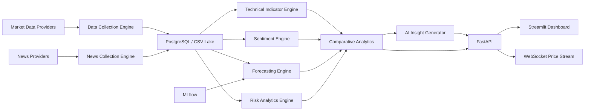

# AI Stock Market Analytics & Prediction Platform

Enterprise-grade stock analytics platform for hedge fund research workflows, retail investing dashboards, and financial analyst reporting. The default watchlist compares NVIDIA (`NVDA`), Tesla (`TSLA`), and Apple (`AAPL`), with support for any additional ticker supported by the configured data providers.

## Architecture



## Features

- Automated historical OHLCV collection using Yahoo Finance, with extension points for Alpha Vantage and Polygon.
- Incremental updates, duplicate removal, missing value handling, validation, local data lake writes, and PostgreSQL schema support.
- Technical indicators: SMA, EMA, MACD, RSI, stochastic oscillator, Bollinger Bands, ATR, OBV, and VWAP.
- News ingestion and three-level sentiment analysis: traditional text cleaning, VADER when available, and FinBERT when installed.
- Forecasting with Prophet plus linear fallback, LSTM/GRU deep learning, and XGBoost or Random Forest feature models.
- Risk analytics: volatility, beta, Sharpe, Sortino, maximum drawdown, VaR, expected return, portfolio variance, optimization, and 0-100 risk score.
- Comparative rankings for `NVDA`, `TSLA`, and `AAPL`.
- AI analyst reports, stock screener, portfolio tracker, alert hooks, financial RAG helper, and WebSocket streaming.
- Production-ready FastAPI service, Streamlit dashboard, Docker Compose, Redis, PostgreSQL, MLflow, and CI.

## Project Layout

```text
stock-market-platform/
  app/
    api/              FastAPI routes and WebSocket endpoints
    config/           Environment-driven settings
    dashboard/        Streamlit multipage-style dashboard
    forecasting/      Prophet, LSTM/GRU, XGBoost/RandomForest
    indicators/       Technical feature engineering
    models/           Pydantic API schemas
    risk/             Quant risk and portfolio optimization
    sentiment/        NLP, VADER, and FinBERT sentiment engine
    services/         Collection, comparison, insights, alerts, RAG
    utils/            Logging utilities
  data/               raw, processed, and feature outputs
  docker/             Container image
  notebooks/          Research notebooks
  scripts/            Scheduled jobs
  tests/              Unit and integration tests
```

## Local Setup

```bash
cd stock-market-platform
python -m venv .venv
source .venv/bin/activate
pip install -r requirements.txt
cp .env.example .env
```

For Windows PowerShell:

```powershell
cd stock-market-platform
python -m venv .venv
.\.venv\Scripts\Activate.ps1
pip install -r requirements.txt
Copy-Item .env.example .env
```

## Run The API

```bash
uvicorn app.main:app --reload --port 8000
```

Open:

- API health: `http://localhost:8000/api/v1/health`
- Swagger docs: `http://localhost:8000/docs`
- ReDoc: `http://localhost:8000/redoc`

## Run The Dashboard

```bash
streamlit run app/dashboard/streamlit_app.py
```

Open `http://localhost:8501`.

## Docker Deployment

```bash
docker compose up --build
```

Services:

- FastAPI: `http://localhost:8000`
- Streamlit: `http://localhost:8501`
- PostgreSQL: `localhost:5432`
- Redis: `localhost:6379`
- MLflow: `http://localhost:5000`

## API Reference

Base path: `/api/v1`

| Method | Endpoint | Purpose |
| --- | --- | --- |
| `GET` | `/health` | Service health and environment |
| `GET` | `/stocks/{symbol}/prices?days=365` | Historical OHLCV data |
| `GET` | `/stocks/{symbol}/indicators?days=365` | Technical indicators and engineered features |
| `GET` | `/stocks/{symbol}/news` | News plus sentiment scores |
| `POST` | `/forecast` | Prophet, LSTM, or XGBoost-style forecasting |
| `GET` | `/stocks/{symbol}/risk` | Risk metrics and risk category |
| `GET` | `/comparison?symbols=NVDA,TSLA,AAPL` | Ranking table and executive summary |
| `GET` | `/insights/{symbol}` | AI analyst insight report |
| `GET` | `/screener?symbols=NVDA,TSLA,AAPL` | Technical and risk stock screener |
| `WS` | `/stream/{symbol}` | Real-time style price ticks |

Forecast request example:

```json
{
  "symbol": "NVDA",
  "horizon_days": 30,
  "model": "prophet"
}
```

## Model Documentation

- `ProphetForecaster`: Generates 7, 30, and 90 day forecasts with intervals. If Prophet is unavailable, it uses a deterministic linear trend fallback so local demos still run.
- `LSTMForecaster`: Builds a Keras LSTM plus GRU network with configurable window size, batch size, epochs, and learning rate. If TensorFlow is unavailable, it returns a persistence-style baseline.
- `MLPriceForecaster`: Trains XGBoost when installed and falls back to Random Forest. Metrics include MAE and RMSE.
- `SentimentAnalyzer`: Cleans text, lemmatizes simple tokens, removes stopwords, uses VADER when present, and attempts FinBERT for financial transformer sentiment.
- `RiskAnalyticsEngine`: Converts return distributions into portfolio-grade metrics and a normalized risk score.

## Scheduled Refresh

Run manually:

```bash
python scripts/refresh_data.py
```

Production options:

- Cron or Airflow for scheduled data refresh.
- Celery beat with Redis for task orchestration.
- Kubernetes CronJob for containerized deployments.

## Testing

```bash
pytest --cov=app --cov-report=term-missing --cov-fail-under=80
```

The CI workflow installs lightweight test dependencies and runs the same coverage gate.

## Database Notes

`app/services/database.py` defines tables for `stock_prices` and `news_articles`. Call `create_schema()` during migrations or service bootstrap. For a larger production rollout, replace direct schema creation with Alembic migrations and add provider-specific staging tables.

## Deployment Guide

1. Configure secrets in `.env`: database URL, Redis URL, API keys, and optional OpenAI key.
2. Build containers with `docker compose build`.
3. Start PostgreSQL, Redis, API, dashboard, and MLflow using `docker compose up -d`.
4. Run `python scripts/refresh_data.py` or schedule it.
5. Validate `/api/v1/health`, `/api/v1/comparison`, and the Streamlit dashboard.
6. Monitor API logs, MLflow runs, and model artifacts in `models/`.

## Disclaimer

This project is for analytics, research, and engineering demonstration purposes. It does not provide financial advice, broker execution, or fiduciary recommendations.

